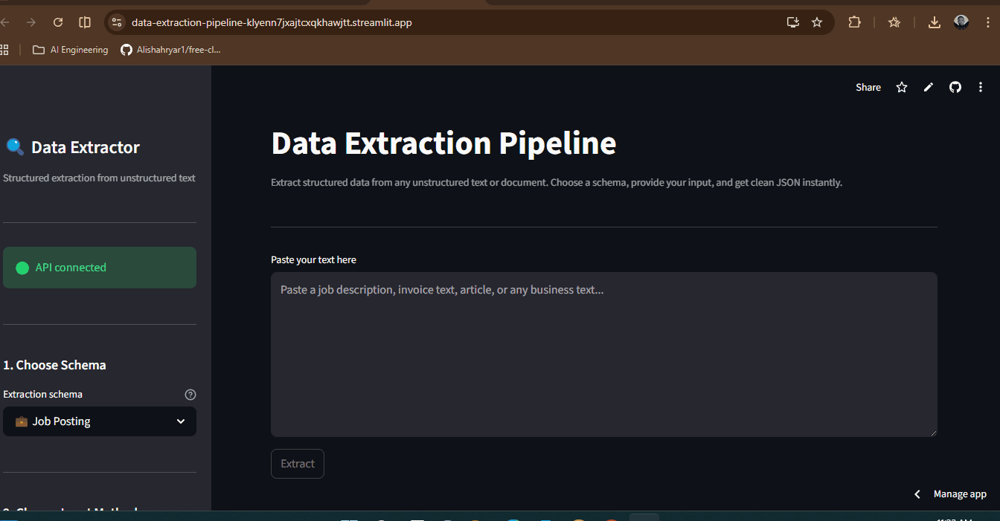

# data-extraction-pipeline

# Data Extraction Pipeline

A production-ready AI system that extracts structured, validated data from 
unstructured text and documents. Feed it a job posting, invoice, news article, 
or business contact sheet — get back clean JSON every time.

**Live Demo:** [data-extraction-pipeline.app](https://data-extraction-pipeline-klyenn7jxajtcxqkhawjtt.streamlit.app/)  
**API Docs:** [data-extraction-pipeline.onrender.com/docs](https://data-extraction-pipeline-bgva.onrender.com/)

---

## Demo



---

## The Problem It Solves

Businesses drown in unstructured text — job descriptions, supplier invoices, 
press releases, email signatures. Extracting specific fields from these manually 
is slow, error-prone, and does not scale. This system automates that extraction 
with guaranteed structure: if a field exists in the text, it is extracted. If 
it does not exist, the field is null. No hallucination, no guessing.

---

## Supported Extraction Schemas

| Schema | What It Extracts |
|---|---|
| **Job Posting** | Title, company, location, salary, requirements, responsibilities, benefits, deadline |
| **Invoice** | Vendor, client, line items, subtotal, tax, total, payment terms |
| **Contact Info** | Names, emails, phones, addresses, LinkedIn, organisations |
| **News Article** | Headline, summary, key entities, sentiment, topics, key facts |

---

## How It Works

```
User provides text or uploads PDF/DOCX/TXT
        │
        ▼
[FastAPI] receives input + schema type
        │
        ▼
[File Parser] extracts plain text if file uploaded
        │
        ▼
[Instructor + Groq LLM] extracts structured data
        │      └── Pydantic validates output
        │      └── Auto-retries if LLM output is invalid
        ▼
Validated Pydantic model → clean JSON response
        │
        ▼
[Streamlit] displays formatted result + download as JSON or Excel
```

---

## Key Engineering Decision — Why Instructor

A naive approach would be to prompt the LLM and parse the JSON response 
manually. This breaks on every edge case — missing fields, wrong types, 
hallucinated keys. Instructor patches the LLM client to validate responses 
against a Pydantic model and automatically retries with the validation error 
if the output is wrong. The result is reliable structured extraction that 
behaves consistently in production.

**Field descriptions are functional code.** Every Pydantic field has a 
`description` that becomes part of the JSON schema passed to the LLM. 
A field named `total_amount` with description 
`"Final total amount due including currency symbol"` extracts correctly 
every time. A vague field name without description produces unreliable output.

**TEMPERATURE=0.0** ensures deterministic extraction — the same input 
always produces the same output. This is not creative generation, it is 
precise information retrieval.

---

## Tech Stack

| Layer | Technology | Purpose |
|---|---|---|
| Structured Extraction | Instructor + Pydantic | Guaranteed schema-validated LLM output |
| LLM | Groq — Llama 3.3 70B | Fast inference, JSON mode |
| File Parsing | pdfplumber + python-docx | PDF and Word document text extraction |
| Backend | FastAPI | REST API with automatic validation |
| Frontend | Streamlit | Upload interface with formatted output display |
| Export | pandas + openpyxl | JSON and Excel download |
| Containerisation | Docker + Docker Compose | Environment parity |
| Backend Hosting | Render | FastAPI deployment via Docker |
| Frontend Hosting | Streamlit Community Cloud | Streamlit deployment |

---

## Project Structure

```
data-extraction-pipeline/
├── app/
│   ├── api/
│   │   ├── routes/
│   │   │   ├── extract.py       # /schemas, /text, /file endpoints
│   │   │   └── health.py        # GET /health
│   │   └── schemas.py           # Request/response Pydantic models
│   ├── core/
│   │   ├── schemas.py           # Four extraction schemas + registry
│   │   ├── extractor.py         # Instructor-powered extraction engine
│   │   └── file_parser.py       # PDF, DOCX, TXT text extraction
│   ├── services/
│   │   └── extraction_service.py # Input validation + extraction orchestration
│   ├── config.py                # Environment variable management
│   └── main.py                  # FastAPI app factory
├── frontend/
│   ├── app.py                   # Streamlit UI with formatted output
│   ├── api_client.py            # HTTP client for backend
│   └── config.py                # Frontend configuration
├── tests/
│   ├── test_extractor.py
│   └── test_api.py
├── Dockerfile
├── Dockerfile.frontend
├── docker-compose.yml
├── .python-version              # Pins Python 3.12.3
├── .env.example
└── requirements.txt
```

---

## Running Locally

### Prerequisites
- Python 3.12+
- [Groq](https://console.groq.com) free API key

### Setup

```bash
git clone https://github.com/YOUR_USERNAME/data-extraction-pipeline.git
cd data-extraction-pipeline

python3 -m venv venv
source venv/bin/activate  # Linux/Mac
venv\Scripts\activate     # Windows

pip install -r requirements.txt
cp .env.example .env
# Add your GROQ_API_KEY to .env
```

**Start backend:**
```bash
uvicorn app.main:app --reload --port 8000
```

**Start frontend** (new terminal):
```bash
cd frontend
streamlit run app.py
```

Visit `http://localhost:8501`.

### Running with Docker
```bash
docker compose up --build
```

---

## API Endpoints

| Method | Endpoint | Description |
|---|---|---|
| `GET` | `/api/v1/extract/schemas` | List all schema types |
| `POST` | `/api/v1/extract/text` | Extract from plain text |
| `POST` | `/api/v1/extract/file` | Extract from PDF, DOCX, or TXT |
| `GET` | `/health` | Health check |

Full interactive docs at `/docs`.

---

## Running Tests
```bash
python -m pytest tests/ -v
```

---

## Environment Variables

| Variable | Required | Default | Description |
|---|---|---|---|
| `GROQ_API_KEY` | ✅ | — | Groq API key |
| `LLM_MODEL` | ❌ | `llama-3.3-70b-versatile` | Groq model |
| `TEMPERATURE` | ❌ | `0.0` | LLM temperature — keep at 0 for extraction |
| `MAX_RETRIES` | ❌ | `3` | Instructor retry attempts on invalid output |
| `APP_ENV` | ❌ | `development` | Environment name |

---

## Author

**Mubarak Olalekan Oladipo**  
AI Software Engineer  
[GitHub](https://github.com/Mubrix2) · [LinkedIn](https://linkedin.com/in/mubarak-oladipo)
